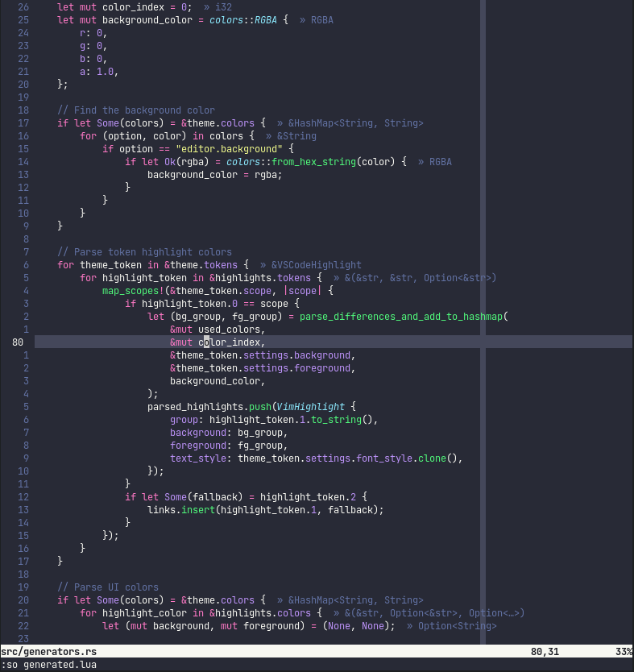
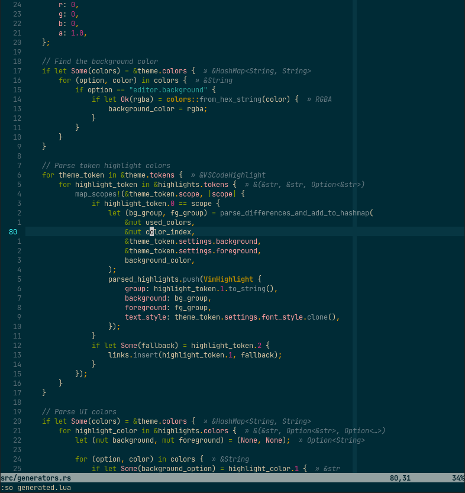
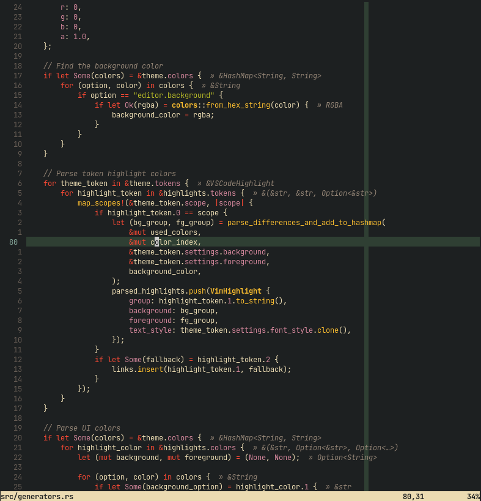

Djanho is a prototype which tries to convert VSCode themes to (Neo)Vim
colorschemes.

## Features
- Handling of VSCode RGBA colors
- Out of the box conversion
- Outputs to both Lua and Vimscript
- Tree-sitter support

## TODO
- Support other plugins than tree-sitter

## Demo
The colorschemes below were converted directly from VSCode's .json theme files.
Dracula                    |  Solarized Dark           | Gruvbox Dark
:-------------------------:|:-------------------------:|:-------------------------
 |  | 

## Building
```bash
cargo build --release
```

## Usage
```bash
djanho vscode-theme.json
```
To see all the available options, use
```bash
djanho --help
```

## Notice
- Some VSCode themes have trailing commas in its jsons, and the current parser
    does not support them. If you receive an runtime error due to these trailing
    commas, please remove them using something such as
    ```bash
    hson -j file.json > file.json
    ```

## Contributing
Feel free to open an issue or a pull request in order to fix bugs, improve
existing highlights or support new plugins/vim features.
