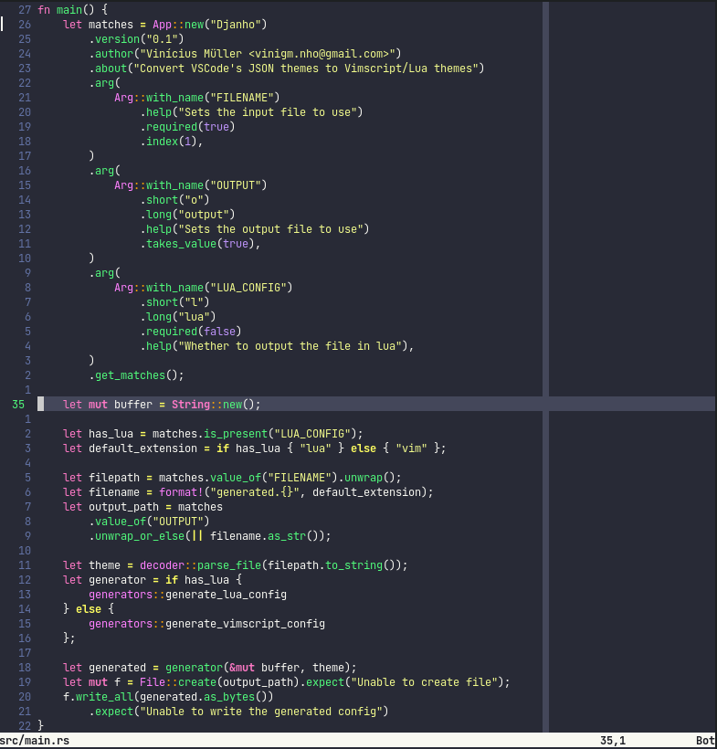
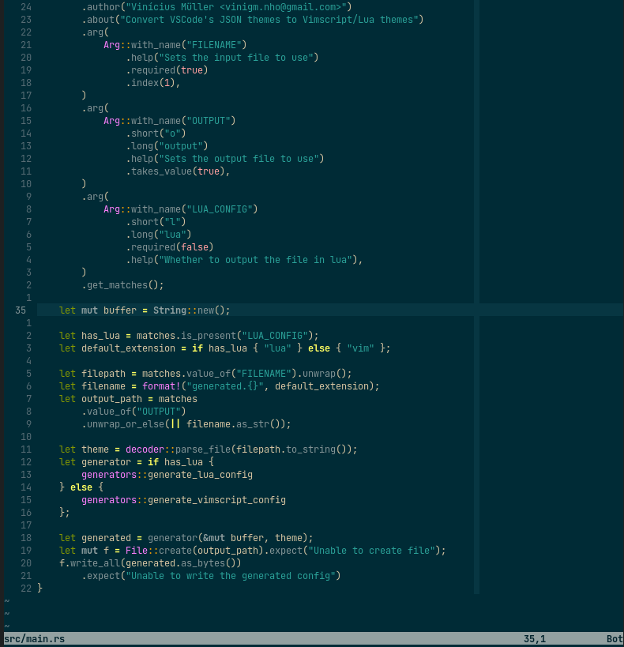
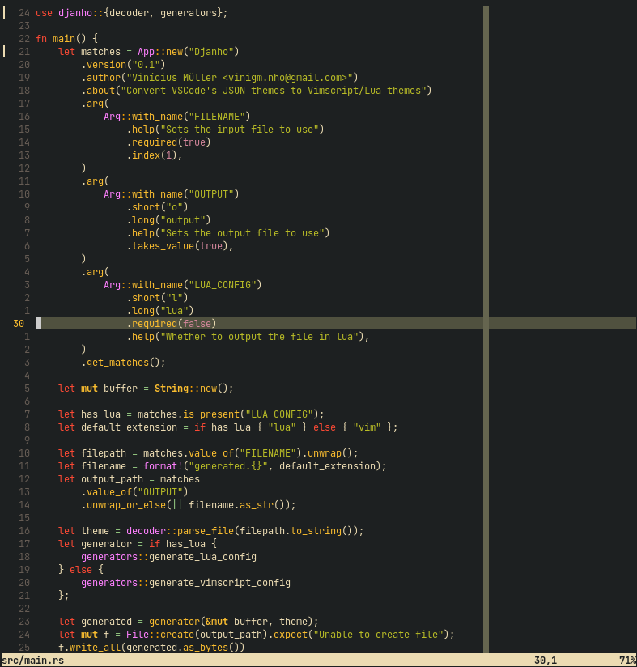

Djanho is a prototype which tries to convert VSCode themes to (Neo)vim
colorschemes.

## Features
- Handling of VSCode RGBA colors
- Out of the box conversion
- Outputs to both Lua and Vimscript

## TODO
- Treesitter support
- Other plugins support

## Demo
The themes below were converted directly from VSCode's .json theme files.
Dracula                    |  Solarized Dark           | Gruvbox Dark
:-------------------------:|:-------------------------:|:-------------------------
 |  | 

## Building
```bash
cargo build --release
```

## Notice
- Some VSCode themes have trailing commas in its jsons, and the current parser
    does not support them. If you receive an runtime error due to these trailing
    commas, please remove them using something such as
    ```bash
    hson -j file.json > file.json
    ```
- Language-specific support is not so good, since most languages creates a lot of
    specific highlight groups, this program does not target them. Hopefully
    adding treesitter support will improve this.

## Contributing
Feel free to open an issue or a pull request in order to fix bugs, improve
existing highlights or support new plugins/vim features.
